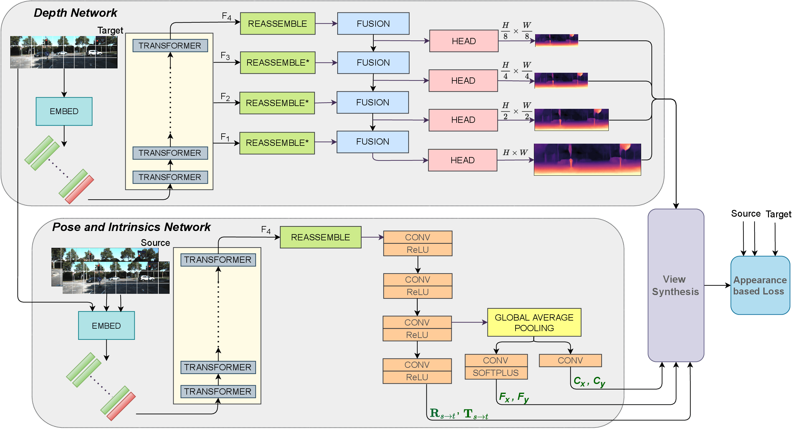

# MT-SfMLearner (v2)

This is the official code for [VISAPP 2022](https://visapp.scitevents.org/?y=2022) paper [Transformers in Self-Supervised Monocular Depth Estimation with Unknown Camera Intrinsics](https://arxiv.org/abs/2202.03131) and its extended paper in [Springer CCIS](https://link.springer.com/chapter/10.1007/978-3-031-45725-8_14±), [Transformers in Unsupervised Structure-from-Motion]().

Authors: [Hemang Chawla](https://scholar.google.com/citations?user=_58RpMgAAAAJ&hl=en&oi=ao),
[Arnav Varma](https://scholar.google.com/citations?user=3QSih2AAAAAJ&hl=en&oi=ao), 
[Elahe Arani](https://scholar.google.nl/citations?user=e_I_v6cAAAAJ&hl=en&oi=ao) and 
[Bahram Zonooz](https://scholar.google.com/citations?hl=en&user=FZmIlY8AAAAJ).



We propose MT-SfMLearner v1 and v2([pdf](assets/MTSfMLearnerv2_Springer_CCIS.pdf)) that show how transformers are more competitive and robust for monocular depth estimation. 

## Install
Hardware details for original training of MT-SfMLearner (v2) can be found in respective papers.

```
git clone https://github.com/NeurAI-Lab/MT-SfMLearner.git
cd MT-SfMLearner
make docker-build
```

## Training
MT-SfMLearner (v2) is trained in a self-supervised manner from videos. 
For training, utilize a `.yaml` config file or a `.ckpt` model checkpoint file with `scripts/train.py`.
```
python scripts/train.py <config_file.yaml or model_checkpoint.ckpt>
```
Example [config file](configs/train_kitti_mtsfmlearnerv2.yaml) to train MIMDepth can be found in [configs](configs) folder.

## Evaluation
A trained model can be evaluated by providing a `.ckpt` model checkpoint.
```
python scripts/eval.py --checkpoint <model_checkpoint.ckpt>
```

For running inference on a single image or folder, 
```
python scripts/infer.py --checkpoint <checkpoint.ckpt> --input <image or folder> --output <image or folder> [--image_shape <input shape (h,w)>]
```

Pretrained Models for MT-SfMLearner and MIMDepth can be found 
`Coming soon!`

## Cite Our Work
If you find the code useful in your research, please consider citing our papers:

<pre>
@inproceedings{chawlavarma2022MTSfMLearnerv2,
  title={Transformers in Unsupervised Structure-from-Motion},
  author={Chawla, Hemang and Varma, Arnav and Arani, Elahe and Zonooz, Bahram},
  booktitle={International Joint Conference on Computer Vision, Imaging and Computer Graphics, Revised Selected Papers},
  pages={281--303},
  year={2022},
  doi={10.1007/978-3-031-45725-8_14},
  organization={Springer Nature}
}
</pre>

<pre>
@inproceedings{varmachawla2022MTSfMLearner,
	author={A. {Varma} and H. {Chawla} and E. {Arani} and B. {Zonooz}},
    booktitle={Proceedings of the 17th International Joint Conference on Computer Vision, Imaging and Computer Graphics Theory and Applications (VISIGRAPP 2022) - Volume 4: VISAPP},
    year={2022},
    pages={758-769},
    publisher={SciTePress},
    doi={10.5220/0010884000003124},
}
</pre>

## License

This project is licensed under the terms of the MIT license.
